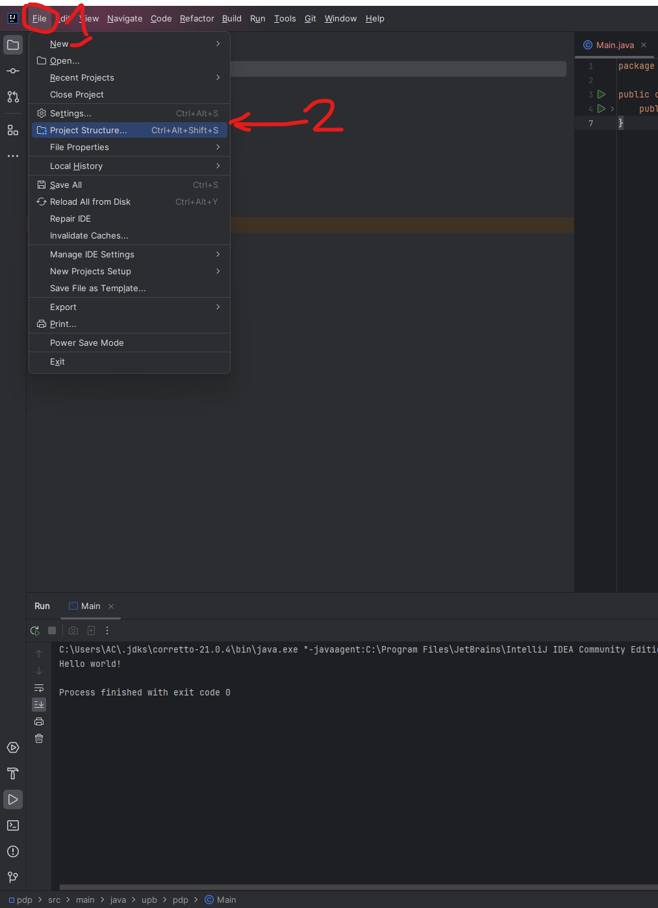
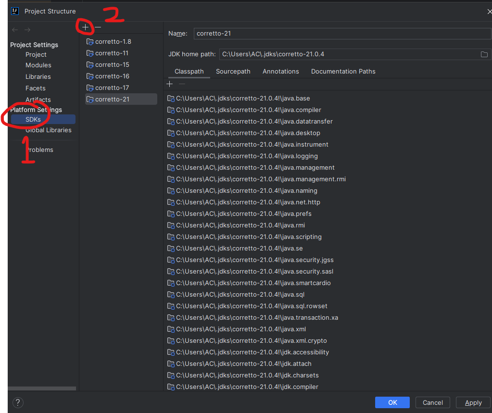
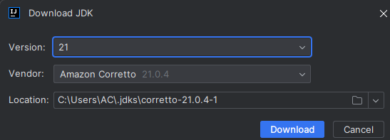
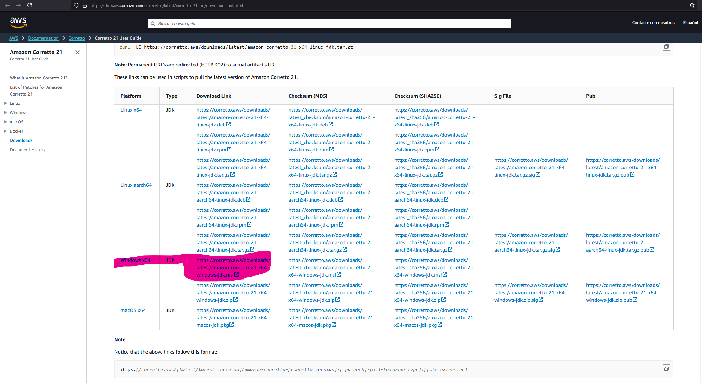
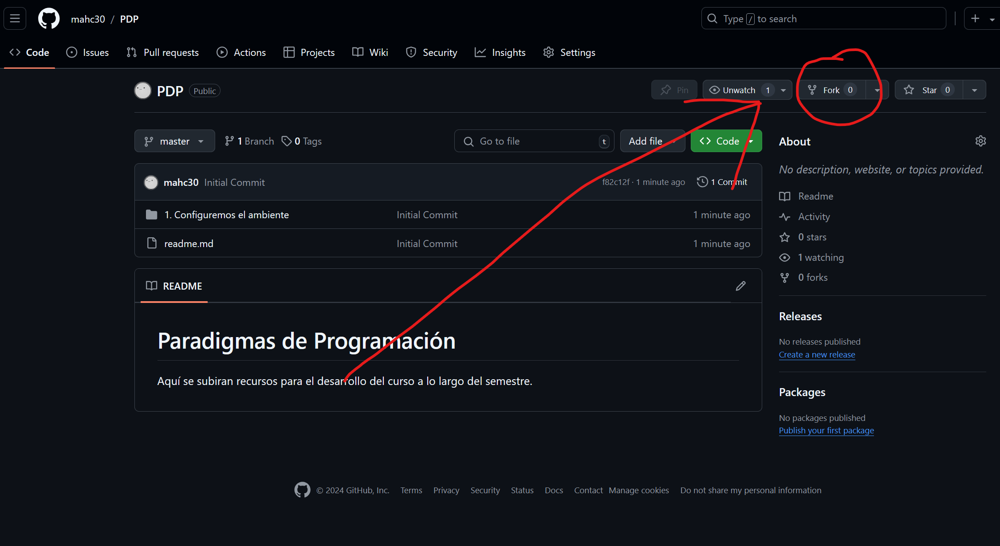
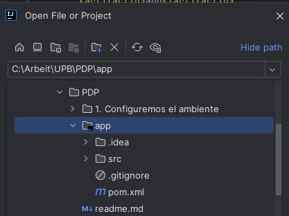
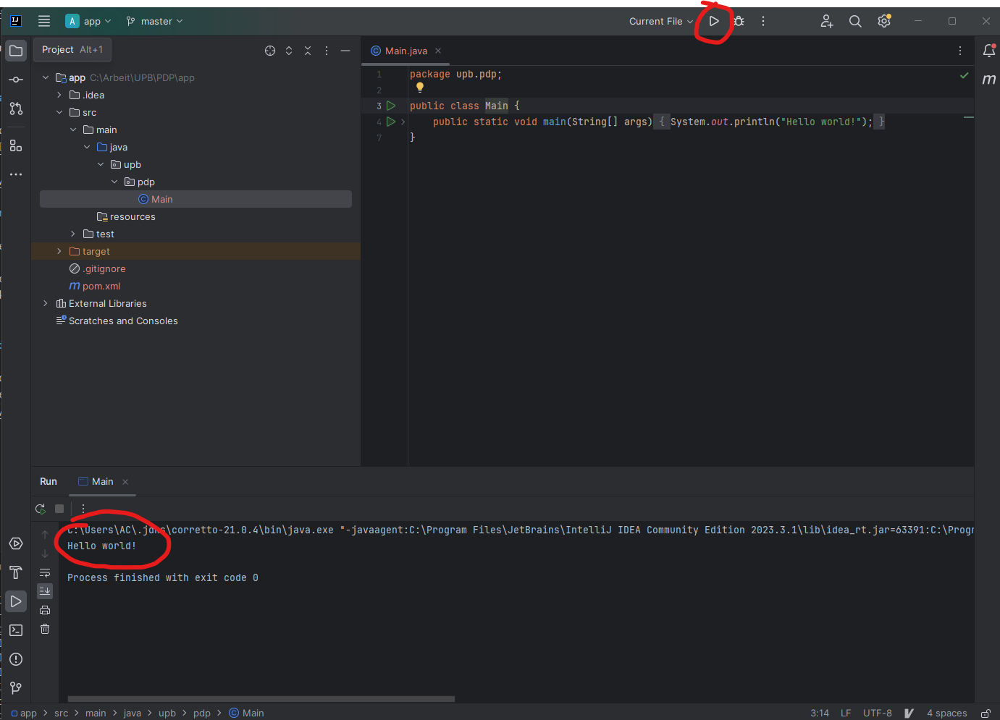

# 1. Instalar un IDE
Recomiento instalar IDE IntelliJ IDEA versión Community, se puede descargar la versión **community** en [la página de JetBrains](https://www.jetbrains.com/idea/download/?section=windows).

# 2. Descargar JDK
## 2.1 Opción 1
Desde IntelliJ en la esquina superior izquierda despliegas el menú dando click en **File** y abres el menú de **Project Structure**.


Luego vas al menú de **SDK** y eliges la opción de descargar JDK que se abre al darle click al **+**.


Eliges la versión 21 y descargas la de Amazon Coretto.


## 2.2 Opción 2
Puedes descargar Java 21 LTS de Amazon Coretto [aquí](https://docs.aws.amazon.com/corretto/latest/corretto-21-ug/downloads-list.html)


# 3. Instalar git

Descargar git de [aquí](https://git-scm.com/download/win).

Al instalar dejar todas las opciones por defecto. 

Una vez instalado puedes verificar que todo quedó bien abriendo una terminal y ejecutando el comando
```
git --version
```

# 4. Crear un Fork del repositorio

Solo es darle click al botón de fork en la esquina superior derecha [en github](https://github.com/mahc30/PDP).



# 4. Clonar Repositorio

Clonar repositorio desde sus propias cuentas.
```
git clone https://github.com/<USUARIO_GITHUB>/PDP.git
git checkout master
```

# 5. Abrir proyecto en IntelliJ

En la esquina superior izquierda, dar click en **File** -> **Open** 
Y abres el proyecto que se encuentra en el directorio **app**.


Puedes probar que todo quedó bien corriendo el programa.
